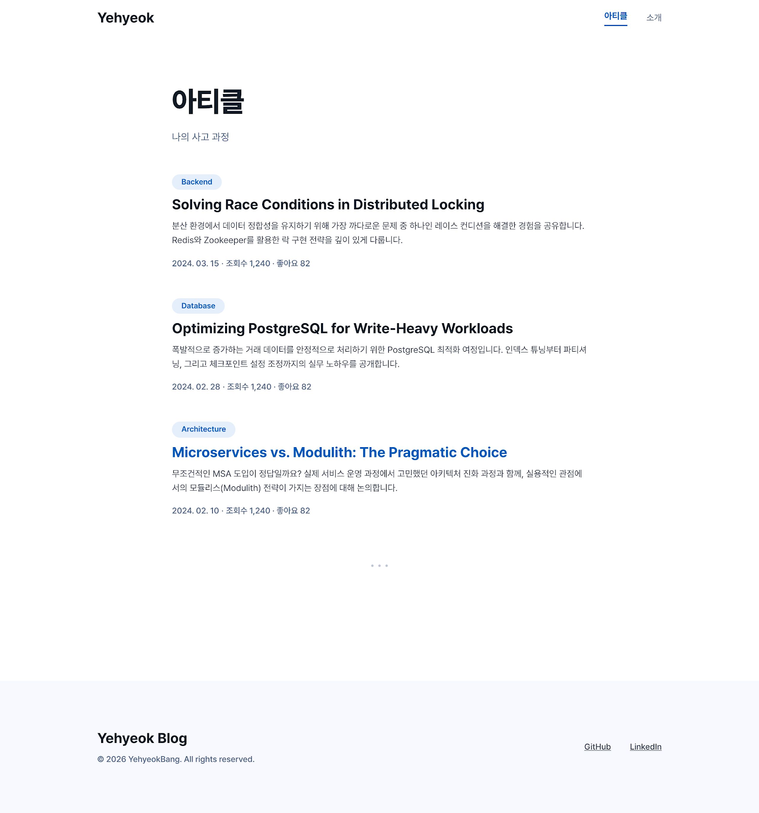
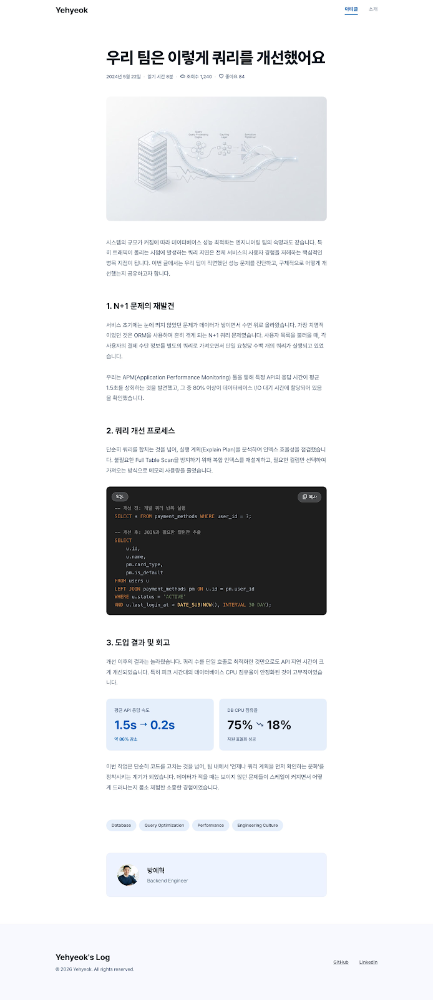

## Overview

Toss Tech (toss.tech) is the canonical example of a highly readable, typography-led, and minimalist engineering blog in South Korea. The base canvas is **pure white** (`{colors.canvas}` — #ffffff) with deep slate-gray ink (`{colors.ink}` — #191F28) for headlines, and a softer, highly legible gray (`{colors.body}` — #333D4B) for body text. The brand's signature **Toss Blue** (`{colors.primary}` — #3182F6) is used exclusively and sparingly for primary text links, active tags, and key interactive moments.

The design is devoid of heavy lines, rigid boxes, or unnecessary visual noise. It relies on generous whitespace, large typography, and subtle off-white backgrounds (`{colors.surface-soft}` — #F9FAFB) to separate content. 

Type runs **Pretendard** (closely matching Toss Product Sans), a highly legible, neutral, and modern geometric neo-grotesque sans-serif. The hierarchy is unmistakable: massive, bold headlines (weight 700+) combined with comfortable, highly readable body text (17px at weight 400 with a generous 1.6 line-height).

**Key Characteristics:**
- **Extreme Minimalism**: No unnecessary borders, no complex backgrounds. Whitespace is the primary structural element.
- **Toss Blue Accent**: `{colors.primary}` (#3182F6) is the only pop of color, providing a sharp, trustworthy tech vibe.
- **Pretendard-first Typography**: Unapologetically sans-serif. The system trusts weight and size for hierarchy, never serif fonts.
- **Soft Geometry**: When containers, image placeholders, or buttons are used, they have smooth, generous border radii (`{rounded.md}` — 8px to 14px, `{rounded.full}` — 9999px for tags).
- **High Readability**: Body text uses `#333D4B` (not pure black) to reduce eye strain, maximizing reading comfort for long technical essays.

## Colors

### Brand & Accent
- **Toss Blue** (`{colors.primary}` — #3182F6): The signature brand color. Used for active text links, primary buttons, and selected states. It is a vibrant, highly trustworthy blue.
- **Toss Blue Hover** (`{colors.primary-hover}` — #1B64DA): A slightly darker shade used for hover states on primary elements.
- **Light Blue Background** (`{colors.primary-surface}` — #E8F3FF): A very pale blue used for tag backgrounds or highlighted text blocks.

### Surface
- **Canvas** (`{colors.canvas}` — #FFFFFF): The default page floor. Pure white.
- **Surface Soft** (`{colors.surface-soft}` — #F9FAFB): A very subtle off-white/gray used for secondary cards or subtle section banding. (코드 블록은 예외적으로 다크 테마 적용)
- **Surface Muted** (`{colors.surface-muted}` — #F2F4F6): Slightly darker gray for input backgrounds, inactive tags, or hover states on list items.

*(Note for Dark Mode: Light Mode is the default. For Dark Mode, Toss perfectly inverts this using `#191F28` for Canvas, `#242A32` for Surface Soft, and text becomes `#F9FAFB`.)*

### Hairlines & Borders
- **Hairline** (`{colors.hairline}` — #E5E8EB): Used incredibly sparingly. Occasionally used for a very subtle bottom border on the top navigation or between list items.
- **Hairline Soft** (`{colors.hairline-soft}` — #F2F4F6): Barely visible divider.

### Text
- **Ink / Headline** (`{colors.ink}` — #191F28): The darkest text color, used for h1, h2, h3, and post titles. Almost black but with a cool slate undertone.
- **Body** (`{colors.body}` — #333D4B): Default running-text color. Soft enough to read for 10 minutes without eye strain.
- **Muted** (`{colors.muted}` — #8B95A1): Used for post dates, author names, read times, and placeholder text.
- **Muted Soft** (`{colors.muted-soft}` — #B0B8C1): Very subtle text used for disabled states or minor captions.
- **On Primary** (`{colors.on-primary}` — #FFFFFF): White text on Toss Blue buttons.

## Typography

### Font Family
The system exclusively runs **Pretendard** (or Toss Product Sans / Apple SD Gothic Neo fallback) for everything — display, body, navigation, and microcopy. Code blocks use **JetBrains Mono** or a system monospace font.

### Hierarchy

| Token | Size | Weight | Line Height | Letter Spacing | Use |
|---|---|---|---|---|---|
| `{typography.display-xl}` | 48px | 800 | 1.3 | -0.02em | Hero headline on main page ("개발" / "디자인") |
| `{typography.display-lg}` | 36px | 700 | 1.4 | -0.01em | Post Detail h1 (Article Title) |
| `{typography.display-md}` | 24px | 700 | 1.4 | 0 | Section heads inside article (h2) |
| `{typography.title-lg}` | 20px | 600 | 1.5 | 0 | Article feed card titles |
| `{typography.title-md}` | 17px | 600 | 1.5 | 0 | Sub-section heads (h3) |
| `{typography.body-lg}` | 17px | 400 | 1.6 | 0 | Default running-text inside listing copy (Highly legible) |
| `{typography.body-md}` | 15px | 400 | 1.5 | 0 | Short descriptions on feed cards |
| `{typography.caption}` | 14px | 500 | 1.5 | 0 | Author names, dates, read times |
| `{typography.code}` | 14px | 400 | 1.5 | 0 | Code blocks — JetBrains Mono |
| `{typography.tag}` | 13px | 600 | 1.4 | 0 | Category tags ("Spring Boot", "Architecture") |

### Principles
Size and weight do all the heavy lifting. Toss does not use all-caps or small-caps for hierarchy. The transition from a massive 36px/700 weight title down to a 17px/400 weight body creates an immediate, clear structure without needing decorative underlines or colors.

## Layout

### Spacing System
- **Base unit:** 4px.
- **Tokens:** `{spacing.xs}` 4px · `{spacing.sm}` 8px · `{spacing.md}` 16px · `{spacing.lg}` 24px · `{spacing.xl}` 32px · `{spacing.xxl}` 48px · `{spacing.section}` 80px.
- **Section padding:** `{spacing.section}` (80px) between major architectural blocks.
- **Paragraph spacing:** `{spacing.xl}` (32px) between paragraphs in an article to let the text breathe.
- **Card spacing:** `{spacing.xxl}` (48px) between articles in the feed list.

### Grid & Container
- **Max content width (Feed):** ~1000px centered.
- **Max content width (Article Detail):** ~700px. This is a strict constraint. Reading width is kept narrow so the eye doesn't have to travel too far horizontally.
- **Alignment:** Almost exclusively left-aligned. Center alignment is rarely used except for standalone hero images or empty states.

### Whitespace Philosophy
"Whitespace is a component." Instead of using a `
` or a border to separate a section, Toss uses 80px of vertical whitespace. The page feels incredibly light, fast, and open. 

## Elevation & Depth

The system is virtually **flat**. 
- **Flat (no shadow):** 99% of surfaces. Body, headers, cards, footer.
- **Subtle Float:** `box-shadow: 0 4px 16px rgba(0, 0, 0, 0.04)` — Used extremely sparingly, perhaps on a sticky top-nav when scrolling, or a floating TOC (Table of Contents) on desktop.
- No heavy drop shadows. Depth is achieved through `{colors.surface-soft}` backgrounds vs `{colors.canvas}` white.

## Components

### Top Navigation
**`top-nav`** — Pure white surface `{colors.canvas}`, sticky at top. Height 60px. Contains a simple text logo ("Yehyeok") on the left in `{colors.ink}` (weight 700), and simple text links ("아티클", "소개") on the right in `{colors.body}`. Active links turn `{colors.ink}`. No bottom border unless scrolled.

### Article Feed Card

**`article-feed-item`** — A flat, borderless block. Contains a thumbnail image (optional) with `{rounded.md}` (12px radius). Below or beside it: Title in `{typography.title-lg}`, a short 2-line description in `{typography.body-md}` (`{colors.body}`), and a meta line (e.g. `2024. 03. 15 · 조회수 1,240 · 좋아요 82`) in `{typography.caption}` (`{colors.muted}`). Separated from the next item purely by `{spacing.xxl}` (48px) whitespace.

### Tags / Badges
**`tag-inactive`** — Background `{colors.surface-muted}`, text `{colors.body}`, padding 6px × 12px, `{rounded.full}` (pill shape).
**`tag-active`** — Background `{colors.primary-surface}`, text `{colors.primary}`, same padding and shape. Used to indicate the currently filtered category.

### Article Detail (Post Page)

**`article-header`** — Massive left-aligned Title in `{typography.display-lg}`. Below it, meta info (Date · 읽기 시간 · 조회수 · 좋아요) in `{typography.caption}`.
**`article-body`** — Constrained to 700px. Paragraphs in `{typography.body-lg}`. Links inside text are strictly `{colors.primary}` with no underline, underlining only on hover. 본문 하단에는 작성자 프로필 정보가 포함됩니다.
**`code-block`** — Background is consistently Dark Theme (e.g., `#1E1E1E` or `{colors.ink}`), padding 24px, `{rounded.md}` (8px radius). Text uses syntax highlighting optimized for dark backgrounds. Includes a simple "복사" (Copy) button on the top right.

### MDX Custom Components
**`metric-highlight-card`** — 커스텀 MDX 컴포넌트(React). 주요 지표 개선(예: API 응답 속도, CPU 점유율 등)을 시각적으로 강조하기 위해 사용. 연한 파란색 배경(`{colors.primary-surface}`)과 둥근 모서리(`{rounded.lg}`)를 적용.

### Table of Contents (TOC)
**`sticky-toc`** — Sits to the right of the 700px content column on desktop. Font size `{typography.caption}`. Inactive links are `{colors.muted}`, active section link turns `{colors.primary}` and weight 600. No borders, just floating text perfectly aligned.

## Responsive Behavior
- **Mobile (< 768px):** Content width takes 100% with 24px horizontal padding. TOC disappears completely.
- **Desktop (> 1024px):** Content centers at 700px. TOC appears in the right margin.

## Do's and Don'ts
### Do
- Use **Pretendard** and trust its weight for hierarchy.
- Use generous line-heights (1.6) for body text.
- Use whitespace (`margin-bottom: 80px`) to separate sections instead of borders.
- Keep the reading column narrow (~700px).

### Don't
- Don't use serif fonts.
- Don't use pure black (`#000000`). Always use `{colors.ink}` (#191F28).
- Don't use heavy drop shadows.
- Don't use boxes or borders to group content; use proximity and whitespace.
- Don't use any accent color other than `{colors.primary}` Toss Blue.
